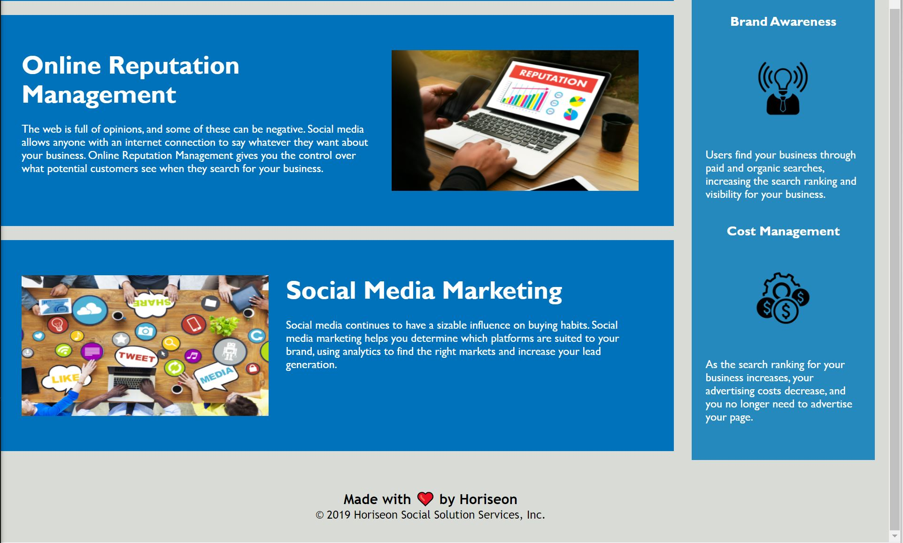

# Refactor Horiseon social solution services Code

## Link to Application
Click on link to see the deployed website [https://sehaj97.github.io/Horiseon-Social-Solution-Services/](https://sehaj97.github.io/Horiseon-Social-Solution-Services/)

## Description
The page have code for Horiseon Social Solution Services which provide digital marketing services.

The project was clean coded to contain semantic html tags, accessibility for the page and styles to keep it consistent.

Assests folder contain images and css folder.

### Clone the repository
git clone git@github.com:sehaj97/Horiseon-Social-Solution-Services.git

_or_

git clone https://github.com/sehaj97/Horiseon-Social-Solution-Services.git

## Screenshot

